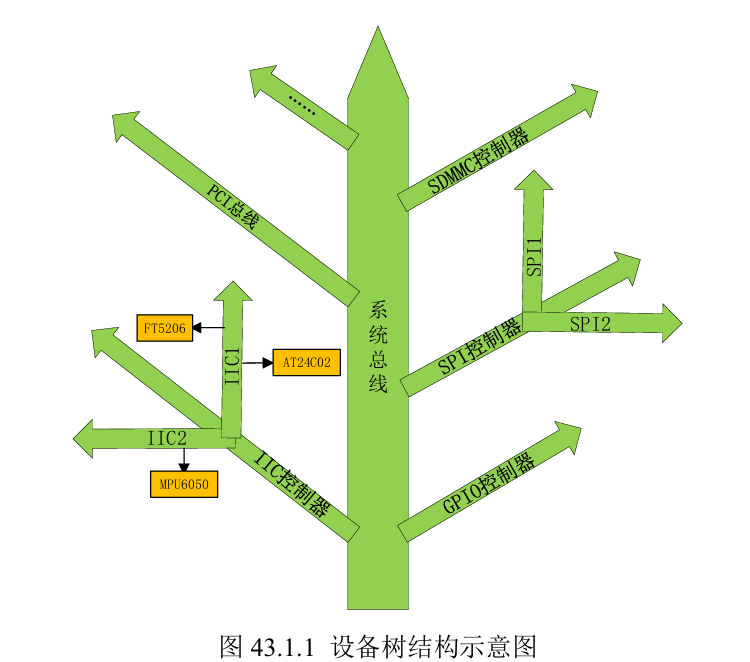

# 設備樹 device tree
## 1. 什麼是設備樹
1. `uboot` 啟動內核用到`zImage`、`.dtb`。通過bootz啟動內核。
    - U-Boot 如何把 kernel 和 device tree blob (DTB) 載到記憶體裡，然後啟動它
    - U-Boot 啟動 zImage（ARM kernel image）＋可選的 initrd，再加上一個 DTB。
    - 把 `zImage` 放到 DRAM 的哪裡。
    - 把 `.dtb` 放到 DRAM 的哪個位置
    ```bash
    bootz 0x8080_0000(zImage` 放到 DRAM 的哪裡)   - (initrd 位址略過（沒有 initrd，就填個 `-`）)   0x8300_0000(把 .dtb 放到 DRAM 的哪個位置)
    ```
2. 設備樹: 設備和樹。(用樹形結構去描述版級設備)
    - `.dts`: device tree source，`.dts`是文件，用一個文件去把你開發版的這些訊息給描述出來(CPU數量、記憶體機地址多少、i2c接口接了那些設備、spi接口接了那些設備、...)
3. 在單片機驅動裡面比如: W25QXX，SPI，速度，都是在`.c`文件寫死的。板級訊息都寫到.c裡面。導致linux內核擁腫(很胖)，因此，將板子的訊息做成獨立的格式，文件擴展名為`.dts`。
    - 一個平台或機器對應一個`.dts`。


---
U-Boot 如何把 kernel 和 device tree blob (DTB) 載到記憶體裡，然後啟動它──

```bash
bootz 0x8080_0000   -   0x8300_0000
```

1. **bootz**
   U-Boot 啟動 zImage（ARM kernel image）＋可選的 initrd，再加上一個 DTB。

2. **0x8080 0000** → zImage 載入位址
   這是把 `zImage` 放到 DRAM 的哪裡。

3. **-** → initrd 位址略過（沒有 initrd，就填個 `-`）

4. **0x8300 0000** → DTB 載入位址
   這裡把 `imx6ull-alientek-emmc.dtb` 放到 DRAM 的哪個位置。

---

### 為什麼不是通用的「0x8080 0000 / 0x8300 0000」？

這兩個地址是針對 **i.MX6ULL-ALIENTEK-EMMC** 板子上 DRAM 佈局選的。不同 SoC／板子的物理記憶體映射都不一樣，你一定要：

1. **查板子手冊** 看 SDRAM 的起始物理位址（Physical DRAM base）。
2. **對應 U-Boot 環境變數**（像是 `loadaddr`、`fdt_addr_r` 這類），確定它們指向的記憶體區段不會和 kernel、UBoot 自己、或其他資源衝突。

---

### 樹莓派 5 要不要也用這組地址？

不要直接沿用 `0x8080_0000` / `0x8300_0000`。樹莓派的 DRAM base 通常和 NXP i.MX 的完全不同，你需要：

* 在 RPi5 的 U-Boot prompt 下，用 `printenv loadaddr fdt_addr`（或類似變數名）看預設值；
* 或是查你用的 U-Boot build 裡對 RPi5 的 memory map 設定，再決定要把 kernel、DTB 分別放在哪裡。

舉例，在很多 Raspberry Pi 開發板上，你會看到類似：

```bash
loadaddr=0x0200_0000    # kernel 載入
fdt_addr=0x0300_0000    # DTB 載入
```

這些都是跟硬體記憶體配置、UBoot compile-time 定義、以及你在環境變數裡調整過的值有關──請以 RPi5 自己的設定為準。


---

## 1. Device Tree（設備樹）的結構比喻與作用

* **圖43.1.1 的樹**：

  * **主幹（trunk）** 就是 SoC 的系統總線（bus）。
  * **分支（branch）** 是各種控制器，比如 I²C、GPIO、SPI 等。
  * **葉節點（leaf/device）** 則是掛在控制器上的具體外設，比如 FT5206 觸控、AT24C02 EEPROM、MPU6050 六軸感測器。

* **DTS 文件要做什麼**：
  你用一個 `.dts`（Device Tree Source）檔，按照上面這棵樹的層次結構，把板子上所有外設「節點」寫清楚──哪個設備連到哪個 controller、時鐘用多少、GPIO 哪些腳……
  最後編譯成 `.dtb`（Device Tree Blob），Linux 核心開機時就讀這份硬體清單，然後自動把對應的驅動綁到正確的外設上。

---

## 2. 早期（3.x 版以前）沒有 Device Tree 時怎麼做

在 **3.x** 版（更早的 ARM 核心）裡，並沒有這種「樹狀硬體描述」，內核是 **直接在 C 程式碼** 裡寫死板級支援（Board-Support Package）。

* 具體就是在 `arch/arm/mach-xxx/` 或 `arch/arm/plat-xxx/` 裡，每個平台（mach-xxx）都有一大堆 `.c` 檔，裡面用 `struct`、`__initdata`、`platform_device` 之類的東西，手動把所有控制器和外設啟動、註冊進系統。
* 例如在 **`arch/arm/mach-smdk2440.c`** 裡，就有：

  ```c
  static struct s3c2410fb_display smdk2440_lcd_cfg __initdata = {
      .lcon5 = S3C2410_LCDCON5_FRM565 | …,
      /* 這一大串設定，就是在 C 裡面告訴內核：「這塊板子的 LCD 控制器要這樣初始化」 */
  };
  ```

  這種「C 語言直接寫」的方法，就是早期 ARM 平台描述板子硬體的做法。

---

**總結**：

* **現在**：用 **Device Tree**（.dts/.dtb）統一、結構化地描述硬體，核心只要 parse 出來就一切搞定。
* **以前**：內核直接在 `arch/arm/...` 裡用 C 語言寫各種 `struct`、註冊程式，一板一板地維護，維護成本高、移植也不方便。

---

1. **DTS（Device Tree Source）與 DTB（Device Tree Blob）的關係**

   * `.dts` 是「設備樹原始碼檔案」，用人／類似 C 語法的文本描述硬體拓撲（哪顆 SoC、哪些控制器、哪些外設接在哪裡、時鐘、GPIO 等設定）。
   * `.dtb` 則是「編譯後的二進位 blob」，Kernel 開機時直接讀這個檔，不必再解析人類可讀的文字。

2. **怎麼把 `.dts` 變成 `.dtb`？**

   * 需要用到 **DTC（Device Tree Compiler）** 這個工具。
   * DTC 的原始碼就放在 Linux 內核樹的 `scripts/dtc/` 下面。

3. **Makefile 裡的 `hostprogs-y := dtc`**

   * 這一行告訴內核的 build 系統：「在主機（Host）上要編出一個叫 `dtc` 的執行檔」。
   * 換句話說，當你編內核時，會先把這支 DTC 編出來，之後再用它來把 `.dts` 編譯成 `.dtb`。

---

**簡單總結**：

* 用文字（`.dts`）寫好設備樹 → 用 DTC 這個編譯器（`dtc`） → 產出機器讀得懂的二進位 `.dtb` → Linux 核心開機時載入。
