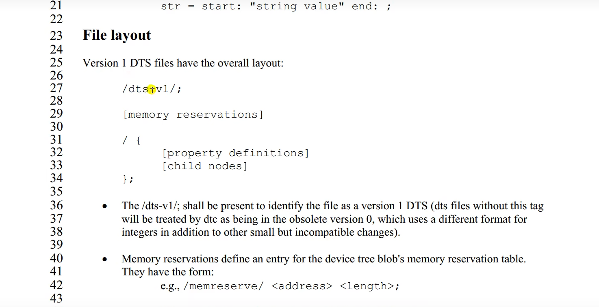

# 設備樹 device tree
## 1. 什麼是設備樹
1. `uboot` 啟動內核用到`zImage`、`.dtb`。通過bootz啟動內核。
    - U-Boot 如何把 kernel 和 device tree blob (DTB) 載到記憶體裡，然後啟動它
    - U-Boot 啟動 zImage（ARM kernel image）＋可選的 initrd，再加上一個 DTB。
    - 把 `zImage` 放到 DRAM 的哪裡。
    - 把 `.dtb` 放到 DRAM 的哪個位置
    ```bash
    bootz 0x8080_0000(zImage` 放到 DRAM 的哪裡)   - (initrd 位址略過（沒有 initrd，就填個 `-`）)   0x8300_0000(把 .dtb 放到 DRAM 的哪個位置)
    ```
2. 設備樹: 設備和樹。(用樹形結構去描述版級設備)
    - `.dts`: device tree source，`.dts`是文件，用一個文件去把你開發版的這些訊息給描述出來(CPU數量、記憶體機地址多少、i2c接口接了那些設備、spi接口接了那些設備、...)

3. 在單片機驅動裡面比如: W25QXX，SPI，速度，都是在`.c`文件寫死的。板級訊息都寫到.c裡面。導致linux內核擁腫(很胖)，因此，將板子的訊息做成獨立的格式，文件擴展名為`.dts`。
    - 一個平台或機器對應一個`.dts`。

## 2. DTS、DTB、DTC的關係
- `.dts`相當於`.c`，就是DTS源碼文件。
- DTC工具相當於 gcc編譯器，將`.dts`編譯成`.dtb`文件
- `.dtb`相當於bin文件，或可執行文件。

- 通過`make dtbs`編譯所有的`.dts`文件
    ```bash
    make dtbs
    ```
# 3. DTS 語法
1. 設備樹也有頭文件，擴展名為`.dtsi`，可以將一個SOC他的其他所有設備/平台共有的訊息提出來，最為一個通用的`.dtsi`文件。
2. DTS也是 `/`(根) 開始。
3. 從`/`根節點開始描述設備訊息
4. 在`/`根節點外有一些`&cpu`這樣的語句是**追加**

---

這段文字說明了典型的 **版本 1** Device Tree Source（DTS）檔案應該長什麼樣子，其重點可以這樣理解：

1. **版本宣告**

   ```dts
   /dts-v1/;
   ```

   這一行必須出現在檔案最前面，用來告訴 DTC（Device Tree Compiler）這是「版本 1」的 DTS 檔案；
   如果沒有這行，DTC 會把它當作「版本 0」舊格式來處理，兩者在整數格式、語法上都有些微不相容的差異。

2. **記憶體保留（memory reservations）**

   ```dts
   /memreserve/ <address> <length>;
   ```

   這種語法用來告訴內核「這一塊物理記憶體不要給任何 driver 或 kernel 使用」，會寫進最終的 DTB（device tree blob）裡的保留表。

   * `<address>`：要保留的起始位址
   * `<length>` ：要保留的長度

3. **根節點與內容**

   ```dts
   / {
       /* property 定義，例如：compatible = "vendor,board"; */
       /* 子節點，例如：uart0: serial@4000 { … }; */
   };
   ```

   * `/ { … };` 這一對斜線加大括號，代表整個 device tree 的「根節點」（root node）。
   * 在大括號裡，你可以放：

     * **屬性（properties）**：像是 `model = "MyBoard";`, `aliases { ... };` 等。
     * **子節點（child nodes）**：像是各種外設（UART、I²C、GPIO……）的節點定義。

---

**總結**：
一個完整的版本 1 DTS 檔案通常長這樣：

```dts
/dts-v1/;

/memreserve/ 0x40000000 0x01000000;   /* 例：保留 64 MiB 記憶體 */
 
/ {
    compatible = "myvendor,myboard";
    model = "MyBoard v1";

    aliases {
        serial0 = &uart0;
    };

    uart0: serial@4000 {
        compatible = "vendor,uart";
        reg = <0x4000 0x100>;
    };

    /* … 其他外設節點 … */
};
```

* **第一行** 定義版本
* **第二段** （可選）定義要保留給特殊用途的記憶體範圍
* **最後一大塊** 定義整顆板子的硬體結構（屬性＋子節點）
